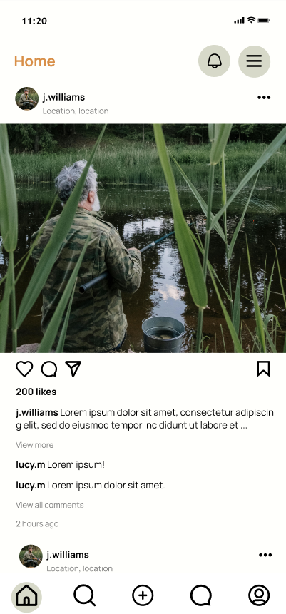
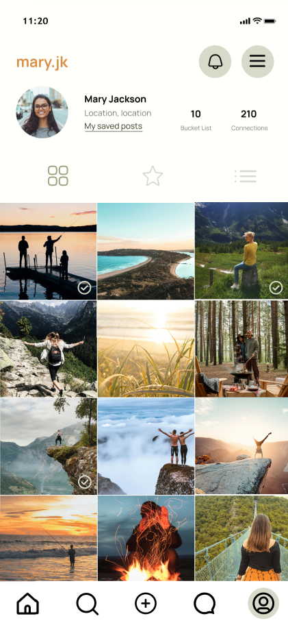

# HookedUp

Welcome to **HookedUp**! This is a social media application built using the Flutter framework. Below, you'll find information on how to install, run, and explore the application.

---

## Features
- Responsive design
- Cross-platform compatibility (iOS, Android, Web)
- Fast performance and smooth UI

---

## Technologies Used
- **Flutter**: Framework for building the app
- **Dart**: Programming language for Flutter
- **ScreenUtil**: For responsive dimensions and font sizes
- **Firebase**: Backend support (Authentication, Database, Storage)
- **GetX**: State management

---

## Screenshots
Here are some screenshots of the application:

| Home Screen                  | Profile Screen                |
|------------------------------|-------------------------------|
|  |  |

---

## Installation Instructions

### Prerequisites
- Ensure you have [Flutter SDK](https://flutter.dev/docs/get-started/install) installed on your system.
- A code editor like [Visual Studio Code](https://code.visualstudio.com/) or [Android Studio](https://developer.android.com/studio).
- [Git](https://git-scm.com/) installed for cloning the repository.

### Step 1: Clone the Repository
```bash
git clone https://github.com/bitmonk/HookedUp.git
cd hookedup
```

### Step 2: Install Dependencies
Run the following command to fetch the required packages:
```bash
flutter pub get
```

### Step 3: Run the Application
Connect your emulator or physical device, then run:
```bash
flutter run
```

---

## Project Folder Structure

### 📁 lib
The main directory containing all the application logic, UI components, and resources.

- **📁 components**: Reusable widgets and UI components.
  - **📁 chat**: Components related to chat functionality.
  - **📁 forum**: Forum-related UI elements like cards and replies.
  - **📁 home**: Widgets for the home screen, such as feed posts and bucket list items.
  - **📁 navigation**: Navigation elements, including the bottom navigation bar and drawer.
  - **📁 openseason**: Widgets for open season events, requests, and status cards.
  - **📁 popup**: Reusable popup modals for various purposes.
  - **📁 profile**: Profile-related components like event cards and connection lists.
  - **📁 settings**: Components for settings, including notification lists and invite boxes.
  - **📁 subscription**: Subscription-related widgets.
  - **Other Components**: Includes buttons (`green_button.dart`, `orange_button.dart`), form inputs, and custom checkboxes/radio buttons.

- **📁 controllers**: State management and logic, e.g., `auth_controller.dart`.

- **📁 model**: Data models for the application.
  - Includes models for feed posts, dummy data, and post details.

- **📁 screen**: Screens for different sections of the app.
  - **📁 auth**: Authentication screens like login, signup, and password reset.
  - **📁 chat**: Screens for chat functionality.
  - **📁 connections**: Connection-related screens.
  - **📁 create_post**: Create post screen.
  - **📁 explainer**: Explainer screen for app onboarding.
  - **📁 forum**: Forum screens, including forum creation and detail pages.
  - **📁 home**: Home screens for activity feeds and social reels.
  - **📁 profile**: Profile screens, including user profiles and saved posts.
    - **📁 user_profile**: Detailed user profile page.
  - **📁 season**: Screens related to open season events and requests.
  - **📁 settings**: Settings screens, such as privacy policy, subscription management, and FAQ.
  - **📁 splash**: Splash screen for app startup.
  - **📁 subscription**: Subscription-related screens like plan selection and payment details.

- **📁 utils**: Utility files for constants, such as `colors.dart`.

- **Other Files**:
  - `firebase_options.dart`: Firebase configuration.
  - `main.dart`: Main entry point of the app.

---

## Contact
If you have any questions or suggestions, feel free to contact us:
- **Email**: ryanlama19@gmail.com
- **GitHub**: [username](https://github.com/bitmonk)
